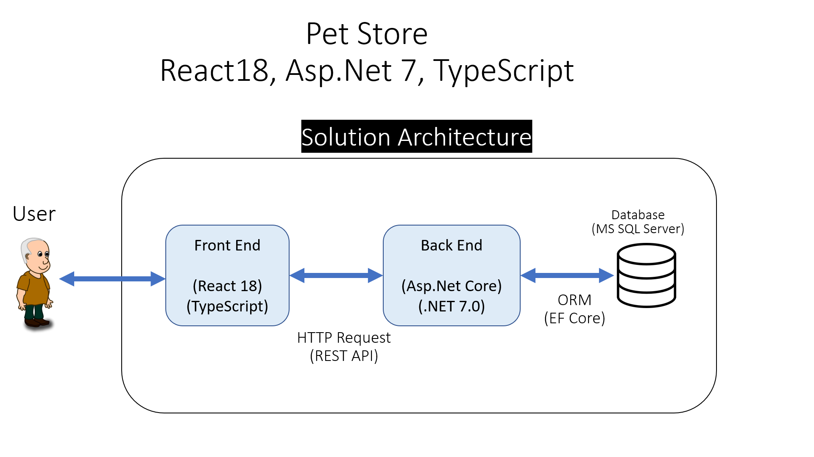

#Pet Store

## YouTube Tutorial

## Solution Technologies

-  Asp.Net Core (.NET 7.0)
-  React 18
-  TypeScript
-  MS SQL SERVER
-  Entity Framework Core

## Solution Architecture

## What is used in this tutorial

### Backend

-  Entities
-  Dtos
-  Context
-  ORM
-  Http Methods
-  Swagger
-  Postman
-  Postman Collections

### Frontend

-  Sending state while redirecting user
-  Nested Routing
-  useState
-  useEffect
-  Sweet Alert on Create, Edit and Delete
-  Confirmation on Delete
-  Elegant, Beatifull and fully Responsive Navbar
-  TypeScript Interface
-  TypeScript Partial
-  Axios
-  SASS
-  Mixin
-  Moment
